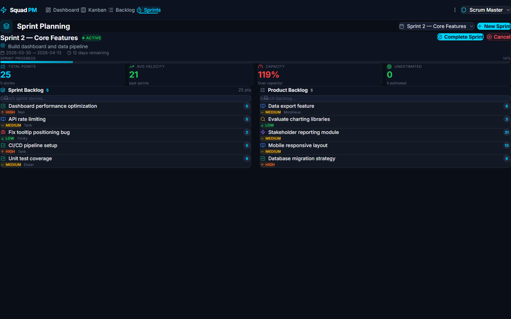
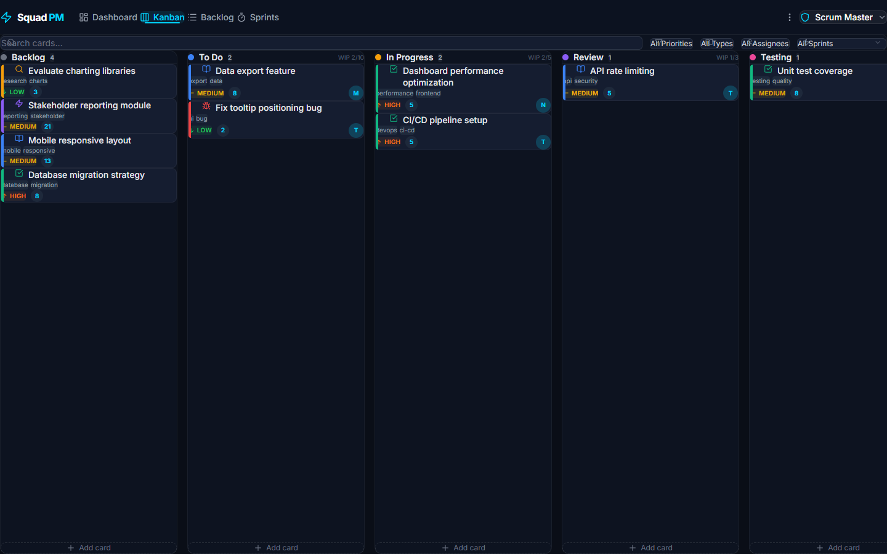
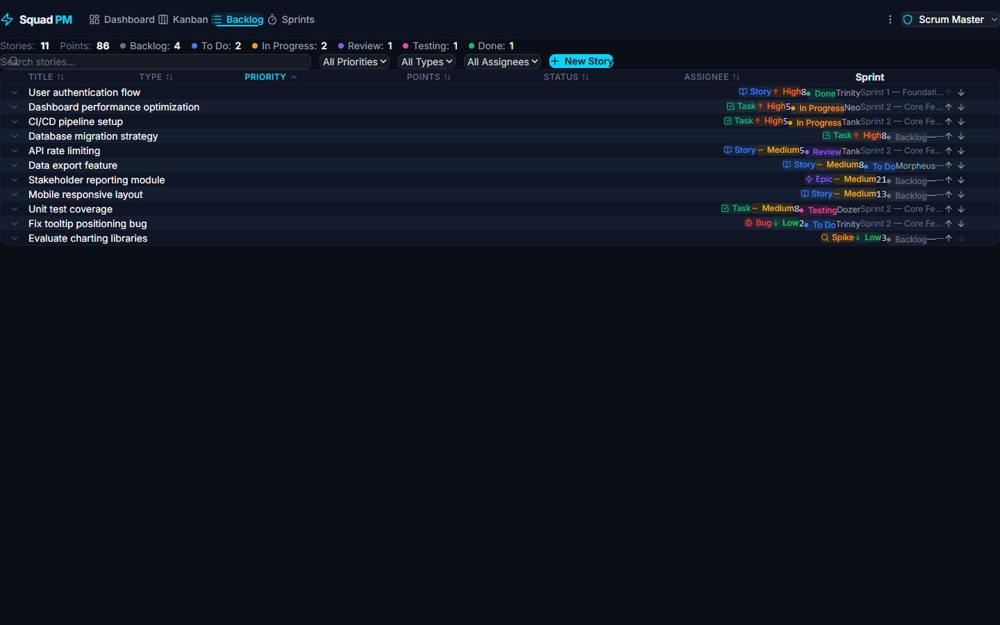
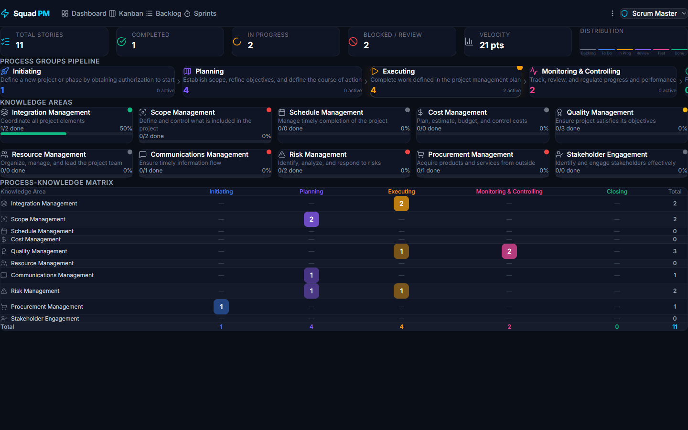
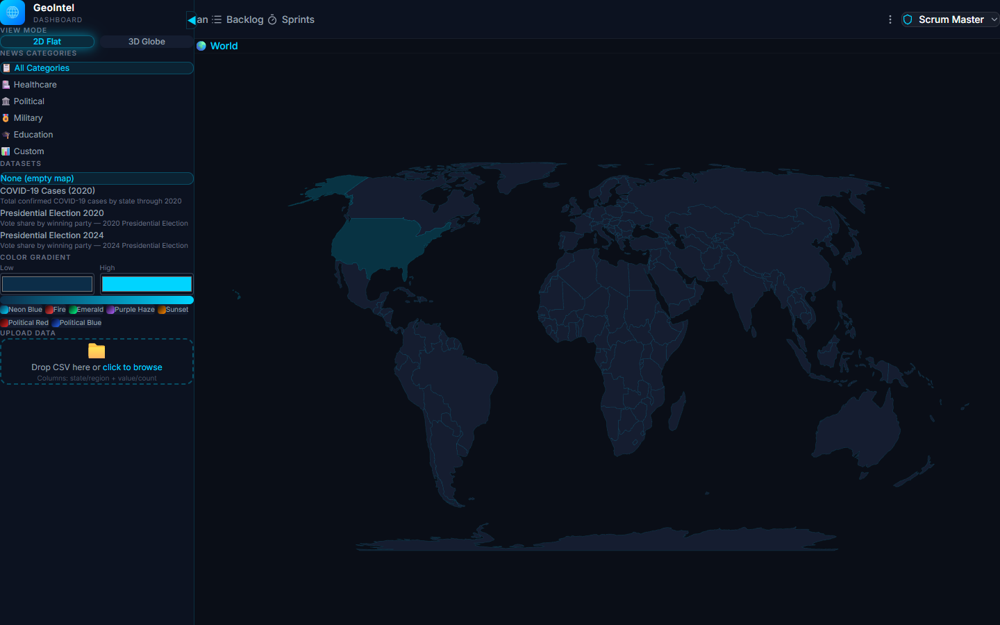
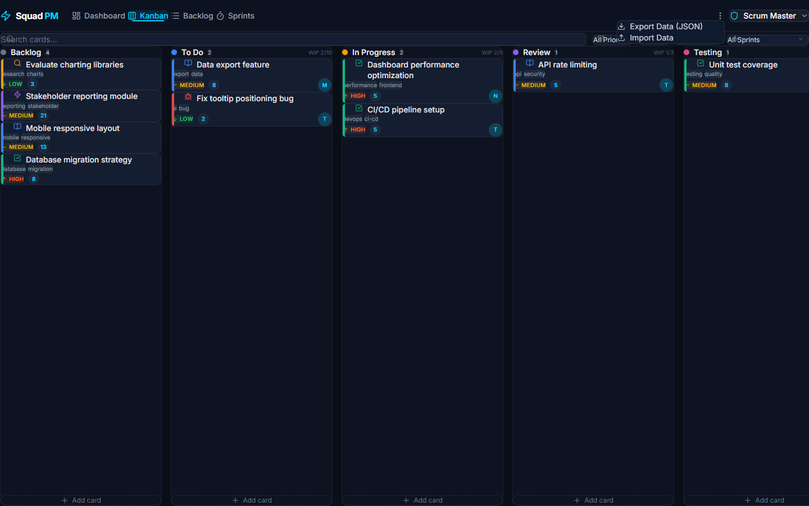

# 📖 AbeOps — Step-by-Step Tutorial

This tutorial walks you through every feature of AbeOps, from setup to running a full sprint cycle.

---

## Table of Contents

1. [Setup & First Launch](#1-setup--first-launch)
2. [Understanding the Interface](#2-understanding-the-interface)
3. [Choosing Your Persona](#3-choosing-your-persona)
4. [Working with the Kanban Board](#4-working-with-the-kanban-board)
5. [Managing the Product Backlog](#5-managing-the-product-backlog)
6. [Running a Sprint](#6-running-a-sprint)
7. [Playing Scrum Poker](#7-playing-scrum-poker)
8. [Using the PMP Dashboard](#8-using-the-pmp-dashboard)
9. [Exploring the GeoIntel Dashboard](#9-exploring-the-geointel-dashboard)
10. [Data Export & Import](#10-data-export--import)
11. [Tips & Keyboard Shortcuts](#11-tips--keyboard-shortcuts)
12. [Automated Screenshots](#12-automated-screenshots)

---

## 1. Setup & First Launch

### Prerequisites

- **Node.js** version 18 or higher
- **npm** version 9 or higher

### Installation

```bash
# Navigate to the project
cd Squad/geo-dashboard

# Install all dependencies
npm install

# Start the development server
npm run dev
```

You should see output like:

```
VITE v8.0.2  ready in 1250 ms
  ➜  Local:   http://localhost:5173/
```

### Open the App

Open your browser and navigate to **http://localhost:5173/**. You'll land on the default persona's view (Scrum Master → Sprint Planning).


### First-Time Experience

The app ships with **sample data** so you can explore immediately:
- **11 stories** across various statuses (Backlog, To Do, In Progress, Review, Testing, Done)
- **2 sprints** — Sprint 1 (completed) and Sprint 2 (active)
- **Team members** — Trinity, Neo, Tank, Morpheus, Dozer

> 💡 **Data is stored in your browser's `localStorage`.** To reset to sample data, open DevTools → Application → Local Storage → delete `abeops-data` and refresh.

---

## 2. Understanding the Interface

### Top Navigation Bar

The top bar has three key sections:

| Section | Location | Purpose |
|---------|----------|---------|
| **AbeOps logo** | Top-left | Click to go to your persona's default view |
| **Navigation tabs** | Center | Switch between views (Dashboard, Kanban, Backlog, Sprints, PMP) |
| **Persona selector** | Top-right | Switch between roles |

The tabs shown depend on your current persona. A Team Member sees only Kanban and Sprints, while a Project Manager sees all five views.

---

## 3. Choosing Your Persona

### What Are Personas?

Personas represent different roles in a project team. Each persona gets:
- A **different default landing page**
- A **different set of navigation tabs**
- **Independent saved state** (filters, selected sprint, current view)

### How to Switch

1. Click the **persona button** in the top-right corner (shows your current role name)
2. The dropdown reveals all 8 available personas with descriptions
3. Click any persona to switch instantly


### Available Personas

| Persona | Icon | Default View | Best For |
|---------|------|-------------|----------|
| **Project Manager** | 💼 Briefcase | PMP Dashboard | Full project oversight, risk tracking, PMBOK alignment |
| **Scrum Master** | 🛡️ Shield | Sprint Planning | Running sprints, facilitating ceremonies, tracking velocity |
| **Team Member** | 💻 Code | Kanban Board | Seeing assigned work, updating task status |
| **Product Owner** | 🎯 Target | Backlog | Prioritizing features, grooming the backlog |
| **QA Lead** | 🧪 TestTube | Kanban Board | Monitoring testing column, quality gates |
| **Business Analyst** | 📊 BarChart | Backlog | Requirements analysis, scope documentation |
| **Stakeholder** | 👁️ Eye | Dashboard | Read-only project status overview |
| **DevOps Lead** | 🖥️ Server | Kanban Board | Infrastructure tasks, deployment tracking |

<details>
<summary>📸 Persona Views Gallery</summary>

| Project Manager | Product Owner |
|:-:|:-:|
|  |  |

| Team Member | Stakeholder |
|:-:|:-:|
|  |  |

</details>

### State Preservation

Each persona saves its own state independently. Try this:

1. As **Scrum Master**, go to Kanban and filter by "High" priority
2. Switch to **Product Owner** — you'll land on the Backlog (their default)
3. Search for "auth" in the Backlog
4. Switch back to **Scrum Master** — your "High" priority filter is still active

This works because the app stores a separate `PersonaState` object for each role in `localStorage`.

---

## 4. Working with the Kanban Board

Navigate to **Kanban** using the top nav tab.



### Board Layout

The board has **6 columns**, each representing a workflow stage:

| Column | WIP Limit | Color | Description |
|--------|-----------|-------|-------------|
| **Backlog** | None | Gray | Ideas and future work |
| **To Do** | 10 | Blue | Ready to start |
| **In Progress** | 5 | Amber | Currently being worked on |
| **Review** | 3 | Purple | Code review / peer review |
| **Testing** | 3 | Pink | QA and verification |
| **Done** | None | Green | Completed work |

### Drag and Drop

**Move a card** by clicking and dragging it:
- Drag **horizontally** to move between columns (changes the story's status)
- Drag **vertically** to reorder within a column
- The card will snap into place when you release

> ⚠️ **WIP Limits**: When a column reaches its WIP limit, the count badge turns red. You can still add cards, but the warning helps teams maintain flow.

### Creating a New Card

1. Click **"+ Add card"** at the bottom of any column
2. A compact form appears with just a **Title** field for quick entry
3. Click **"More options"** to expand the form and reveal all fields:
   - **Title** (required)
   - **Type** — Story, Bug, Task, Epic, or Spike
   - **Priority** — Critical, High, Medium, or Low
   - **Story Points**
   - **Assignee**
   - **Tags**
   - **Description**
4. Click **Save** to add the card to that column

> 💡 **Quick-Add Mode**: For rapid card creation, just type a title and hit Save — you can fill in the details later by editing the card.

### Filtering Cards

Use the filter bar at the top of the board:

- **Search box** — type to filter by card title
- **All Priorities** — dropdown to show only Critical, High, Medium, or Low
- **All Types** — filter by Story, Bug, Task, Epic, or Spike
- **All Assignees** — filter by team member
- **All Sprints** — filter by sprint assignment

### Card Anatomy

Each card shows:
- **Type color strip** — a colored left border stripe indicating story type (each type has a distinct color)
- **Type icon** (📖 Story, 🐛 Bug, ✅ Task, ⚡ Epic, 🔍 Spike)
- **Title** in white
- **Tags** as gray chips below the title (up to 3 visible; if a card has more than 3 tags, a **"+X more"** indicator appears)
- **Priority badge** with color and arrow icon
- **Story points** in a cyan circle
- **Assignee initial** in the bottom-right corner

### Editing a Card

Click the **edit icon** (pencil) on any card to open the edit form. You can modify all fields including acceptance criteria and PMP classifications (process group, knowledge area).

### Deleting a Card

Deleting a card uses a **2-step confirmation** to prevent accidental deletions:

1. Click the **trash icon** (🗑️) on any card
2. The button changes to **"Confirm delete?"**
3. Click **"Yes, delete"** to permanently remove the card

> 💡 If you don't confirm within **3 seconds**, the confirmation auto-clears and the card returns to its normal state.

---

## 5. Managing the Product Backlog

Navigate to **Backlog** using the top nav tab.



### Overview Bar

The top summary shows at-a-glance metrics:
- **Stories: 11** — total count
- **Points: 86** — sum of all story points
- Status counts with color-coded dots (Backlog, To Do, In Progress, Review, Testing, Done)

### Sorting

Click any **column header** to sort:
- **Title** ↕ — alphabetical
- **Type** ↕ — by story type
- **Priority** ↕ — Critical → Low (default sort)
- **Points** ↕ — by story points
- **Status** ↕ — by workflow stage
- **Assignee** ↕ — by team member name

Click the same header again to reverse the sort direction.

### Filtering

Use the toolbar filters:
- **Search box** — real-time text search across titles
- **All Priorities** — dropdown filter
- **All Types** — dropdown filter
- **All Assignees** — dropdown filter

### Expanding a Story

Click the **chevron** (▼) on any row to expand it and see:
- Full description
- Acceptance criteria
- Process group and knowledge area (PMP fields)
- Edit and delete actions

### Creating a New Story

1. Click the **"+ New Story"** button (cyan, top-right of the toolbar)
2. Fill in the story form:
   - Title, description, type, priority
   - Story points, assignee
   - Tags (comma-separated)
   - Acceptance criteria (one per line)
   - PMP Process Group and Knowledge Area
3. Click **Create** to add it to the backlog

---

## 6. Running a Sprint

Navigate to **Sprints** using the top nav tab.


### Sprint Overview

The sprint view shows:
- **Sprint name and status** (Planning, Active, Completed, Cancelled)
- **Sprint goal** — what the team aims to achieve
- **Date range** with days remaining
- **Progress bar** showing completion percentage

### Sprint Metrics

Four key metrics cards:

| Metric | Description |
|--------|-------------|
| **Total Points** | Sum of story points in the sprint |
| **Avg Velocity** | Average velocity from completed sprints |
| **Capacity** | Current load vs. average velocity (% — red if over 100%) |
| **Unestimated** | Stories without story points |

### Managing Stories in a Sprint

The view is split into two panels:

**Left panel — Sprint Backlog:**
- Shows stories assigned to the current sprint
- Click a story to view details
- Search within sprint stories

**Right panel — Product Backlog:**
- Shows unassigned stories
- Click the **→ arrow** on any story to move it into the sprint
- Click the **← arrow** on sprint stories to move them back out

### Creating a New Sprint

1. Click **"+ New Sprint"** (top-right)
2. Fill in:
   - **Sprint Name** (e.g., "Sprint 3 — API Layer")
   - **Sprint Goal** (e.g., "Complete REST API endpoints")
   - **Start Date**
   - **End Date**
3. Click **Create Sprint**

### Sprint Lifecycle

1. **Planning** → New sprint, add stories, estimate with Scrum Poker
2. **Active** → Click **"Start Sprint"** to begin the sprint
3. **Complete** → Click **"Complete Sprint"** when the sprint period ends
4. **Cancel** → Click **"Cancel"** if the sprint needs to be abandoned

### Switching Between Sprints

Use the **sprint dropdown** in the top-right area to switch between sprints. The view updates to show that sprint's stories and metrics.

---

## 7. Playing Scrum Poker

Scrum Poker (Planning Poker) is used to estimate story points through team consensus.

### Starting a Poker Session

1. Navigate to **Sprint Planning**
2. Find an unestimated story (or any story you want to re-estimate)
3. Click the **poker chip icon** (🎲) on the story card
4. The Scrum Poker panel opens

### The Poker Interface

The poker session shows:
- **Story title and description** at the top
- **Fibonacci card deck** — 0, 1, 2, 3, 5, 8, 13, 21, 34, 55, 89, ?, ☕
- **Participant list** — you + AI team members
- **Timer** (optional) — for time-boxed estimation rounds


### Card Fan Layout

The Fibonacci cards are arranged in a **circular fan** layout. Each card is slightly rotated to form an arc, and when you **hover** over a card, it lifts upward with a smooth animation — making it easy to browse and select your estimate.

### How to Play

1. **Read the story** — review the title, description, and acceptance criteria
2. **Pick your card** — click a Fibonacci number to cast your vote
3. **AI votes** — simulated team members vote with staggered delays (400–500ms each) using a gaussian distribution centered on your pick, adding realistic variation
4. **Reveal votes** — click **"Reveal"** to see all votes
5. **View statistics** — see min, max, average, mode, and consensus level:
   - **Unanimous** — everyone agrees
   - **Close** — votes within 1 Fibonacci step
   - **Spread** — significant disagreement (triggers discussion)
6. **Min/Max highlighting** — after reveal, the **minimum** vote is highlighted in blue (**LOW**) and the **maximum** in orange (**HIGH**), making outliers easy to spot
7. **Suggested estimate** — the **mode** (most common vote) is shown as the default suggested estimate
8. **Set final estimate** — click the suggested value or type your own
9. **Apply** — the story's points update immediately

### Consensus Levels

| Level | Meaning | Action |
|-------|---------|--------|
| ✅ Unanimous | All votes match | Accept the estimate |
| 🟡 Close | Minor disagreement | Quick discussion, then accept |
| 🔴 Spread | Wide disagreement | Discuss outliers, re-vote |

### After Estimation

- The story's **story points** badge updates on the Kanban board and Backlog
- The sprint's **Total Points** and **Capacity** metrics recalculate
- **Unestimated** count decreases

---

## 8. Using the PMP Dashboard

Navigate to **PMP** using the top nav tab. This view is available to Project Managers, Product Owners, Business Analysts, and Stakeholders.



### Health Summary

The top row shows 6 KPI cards:
- **Total Stories** — all stories in the system
- **Completed** — stories in "Done" status
- **In Progress** — stories currently being worked on
- **Blocked / Review** — stories in Review or Testing (potential bottlenecks)
- **Velocity** — latest sprint velocity with trend indicator (↑ up, ↓ down)
- **Distribution** — mini bar chart showing story counts per status

### Process Groups Pipeline

The 5 PMBOK process groups are displayed as a **horizontal pipeline**:

```
Initiating → Planning → Executing → Monitoring & Controlling → Closing
```

Each group card shows:
- **Icon and label**
- **Description** from the PMBOK guide
- **Story count** — how many stories are tagged with this process group
- **Active count** — how many are currently in-progress
- **Pulse indicator** — the most active group gets a glowing dot

**Click a process group** to filter the entire dashboard by that group. Click again (or click "Clear") to remove the filter.

### Knowledge Areas Grid

10 cards representing the PMBOK knowledge areas:

Each card displays:
- **Icon and label**
- **Description**
- **Health indicator** (colored dot):
  - 🟢 Green — on track (>70% done or making progress)
  - 🟡 Yellow — needs attention (some work in progress)
  - 🔴 Red — at risk (no progress)
  - ⚪ Gray — no stories assigned
- **Progress bar** — done/total with percentage

### Process-Knowledge Matrix

A **heatmap table** crossing the 5 process groups (columns) with 10 knowledge areas (rows):

- Each cell shows the **count of stories** matching that intersection
- **Color intensity** scales with the count (darker = more stories)
- **Row totals** on the right
- **Column totals** at the bottom
- **Grand total** in the bottom-right corner

Use this matrix to identify:
- **Coverage gaps** — cells with "—" mean no work items exist for that intersection
- **Concentration** — cells with high counts may indicate scope creep or focus areas
- **Balance** — ideally, work distributes across knowledge areas proportionally

### Mapping Stories to PMP

When creating or editing a story, you can assign:
- **Process Group** — which PMBOK phase does this belong to?
- **Knowledge Area** — which domain does this address?

Guidelines for mapping:
| If the story is about... | Process Group | Knowledge Area |
|--------------------------|---------------|----------------|
| Project charter, feasibility | Initiating | Integration |
| Requirements gathering | Planning | Scope |
| Building features | Executing | Integration |
| Code reviews, testing | Monitoring & Controlling | Quality |
| Deployment, handoff | Closing | Integration |
| Risk mitigation tasks | Planning/Executing | Risk |
| Team coordination | Executing | Resource |
| Stakeholder updates | Monitoring & Controlling | Communications |

---

## 9. Exploring the GeoIntel Dashboard

Navigate to **Dashboard** using the top nav tab.



### Map Views

Toggle between two visualization modes:
- **2D Flat** — traditional mercator map with SVG-based regions
- **3D Globe** — interactive Three.js globe you can spin and zoom

### Sidebar Controls

The left sidebar provides:

**News Categories:**
- All Categories, Healthcare, Political, Military, Education, Custom
- Click a category to filter the map data

**Datasets:**
- **None (empty map)** — blank canvas
- **COVID-19 Cases (2020)** — state-level case counts
- **Presidential Election 2020** — vote share by party
- **Presidential Election 2024** — vote share by party

**Color Gradient:**
- Pick from preset gradients: Neon Blue, Fire, Emerald, Purple Haze, Sunset
- Political Red / Political Blue for election data
- Custom low/high color pickers

**Upload Data:**
- Drag and drop a CSV file to visualize your own data
- Required columns: `state` or `region` + `value` or `count`

### Map Interactions

- **Hover** over a region to see its tooltip (name + value)
- **Click** a country to drill into its states/regions
- **Breadcrumbs** at the top show your navigation path (World → Country → State)
- **Click a breadcrumb** to navigate back up

---

## 10. Data Export & Import

AbeOps lets you export and import all project data as JSON — useful for backups, sharing, or migrating between browsers.



### Accessing the Menu

1. Click the **⋮ menu** (three dots) in the **top-right of the navigation bar**, next to the persona selector
2. Two options appear:
   - **Export Data (JSON)**
   - **Import Data**

### Exporting Data

1. Click **"Export Data (JSON)"**
2. A JSON file downloads automatically, named `abeops-export-YYYY-MM-DD.json` (e.g., `abeops-export-2025-01-15.json`)
3. The file contains **all stories and sprints** — a complete snapshot of your project state

### Importing Data

1. Click **"Import Data"**
2. A file picker opens — select a previously exported `.json` file
3. The app loads the data and replaces the current project state with the imported data

> ⚠️ **Importing overwrites all existing data.** Export your current data first if you want to keep it.

### Use Cases

- **Backup before clearing data** — export before deleting `localStorage` so you can restore later
- **Sharing project state with team** — export your project, send the JSON file to a colleague, and they import it
- **Moving between browsers** — export from Chrome, import into Firefox (or vice versa)

---

## 11. Tips & Keyboard Shortcuts

### General Tips

- **Reset data**: Open DevTools → Application → Local Storage → delete `abeops-data` → refresh
- **Reset persona**: Delete `abeops-persona-state`→ refresh
- **Quick persona switch**: The dropdown supports keyboard navigation — use ↑/↓ arrows and Enter
- **Escape key**: Closes any open dropdown or modal
- **Data Backup**: Use the export feature (⋮ menu → Export Data) before clearing `localStorage` to preserve your project state
- **Sharing Project State**: Export from one browser, import in another to share the exact project state with teammates

### Workflow Recommendations

**For a Scrum Master running a sprint:**
1. Switch to **Scrum Master** persona
2. Go to **Sprint Planning** → create a new sprint
3. Move stories from the product backlog into the sprint
4. Use **Scrum Poker** to estimate unestimated stories
5. Click **Start Sprint** when planning is complete
6. Monitor progress on the **Kanban Board** daily
7. At sprint end, go back to **Sprint Planning** → **Complete Sprint**

**For a Product Owner grooming the backlog:**
1. Switch to **Product Owner** persona
2. Go to **Backlog** → sort by Priority
3. Click **"+ New Story"** to add new items
4. Expand stories to add acceptance criteria
5. Use priority to rank items for the next sprint
6. Tag stories with PMP Process Group and Knowledge Area

**For a Project Manager tracking PMP compliance:**
1. Switch to **Project Manager** persona
2. Go to **PMP Dashboard**
3. Check the **Knowledge Areas** grid for red/yellow indicators
4. Click process groups to drill into specific phases
5. Review the **Process-Knowledge Matrix** for coverage gaps
6. Navigate to **Backlog** to update stories' PMP classifications

### Data Model Quick Reference

```
Story
├── title, description
├── type: story | bug | task | epic | spike
├── status: backlog | todo | in-progress | review | testing | done
├── priority: critical | high | medium | low
├── storyPoints: number | null
├── assignee: string | null
├── tags: string[]
├── sprintId: string | null
├── acceptanceCriteria: string[]
├── processGroup: PMP process group | null
└── knowledgeArea: PMP knowledge area | null

Sprint
├── name, goal
├── startDate, endDate
├── status: planning | active | review | completed | cancelled
├── velocity: number | null
└── storyIds: string[]

PokerSession
├── storyId
├── votes: { participantName → cardValue }
├── revealed: boolean
├── finalEstimate: number | null
└── participants: string[]
```

---

## 12. Automated Screenshots

AbeOps includes a Puppeteer-based tool that automatically captures documentation screenshots, ensuring visuals stay up to date with UI changes.

### Prerequisites

- **Puppeteer** is already installed as a project dependency
- The dev server must be running before capturing screenshots

### Capturing Screenshots

**Option A — Development server:**

```bash
# Terminal 1: Start the dev server
npm run dev

# Terminal 2: Capture screenshots
npm run screenshots
```

**Option B — Production preview:**

```bash
# Build and start the preview server
npm run build && npm run preview

# In another terminal, capture with the preview port
npm run screenshots -- --port 4173
```

### Output

Screenshots are saved to `docs/screenshots/`. The following 12 screenshots are captured:

| # | Filename | Description |
|---|----------|-------------|
| 1 | `01-kanban-board.png` | Kanban board with cards across columns |
| 2 | `02-backlog-view.png` | Product backlog table view |
| 3 | `03-sprint-planning.png` | Sprint planning with backlog panels |
| 4 | `04-pmp-dashboard.png` | PMP dashboard with process groups and knowledge areas |
| 5 | `05-geo-dashboard.png` | GeoIntel dashboard with map |
| 6 | `06-persona-selector.png` | Persona selector dropdown |
| 7 | `07-persona-pm.png` | Project Manager persona view |
| 8 | `08-persona-po.png` | Product Owner persona view |
| 9 | `09-persona-dev.png` | Team Member persona view |
| 10 | `10-persona-stakeholder.png` | Stakeholder persona view |
| 11 | `11-scrum-poker-setup.png` | Scrum Poker estimation session |
| 12 | `12-data-export-menu.png` | Data export/import menu |

> 💡 **Keep docs current**: Run `npm run screenshots` after making UI changes to automatically update all documentation images.

---

## Need Help?

- **README**: See [../README.md](../README.md) for architecture overview and setup
- **Types**: Check `src/types/pm.ts` for all TypeScript interfaces
- **Constants**: Check `src/constants/pm.ts` for persona configs, columns, and PMP definitions
- **State**: Check `src/context/PMContext.tsx` and `PersonaContext.tsx` for state management logic
